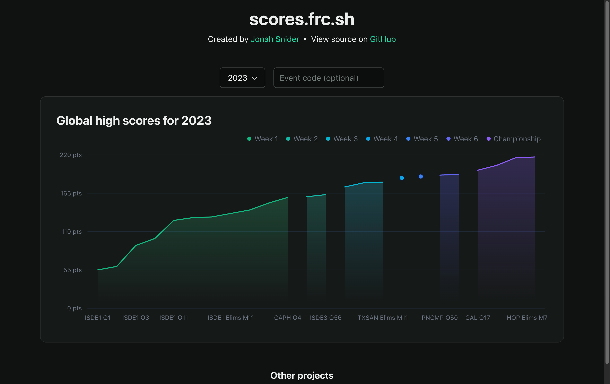

# scores.frc.sh - Top FRC scores

**[scores.frc.sh](https://scores.frc.sh)**

A web app that displays the progression of the top scores in FRC games over time.

## Development

The frontend of scores.frc.sh was built with [Next.js](https://nextjs.org/) and uses [Radix Themes](https://www.radix-ui.com/) and [Tailwind CSS](https://tailwindcss.com/) for styling.

The backend API is built in Python using [FastAPI](https://fastapi.tiangolo.com/).
An API client for the frontend is generated from an OpenAPI 3 schema via [openapi-fetch](https://openapi-fetch.pages.dev/).

For storage, a PostgreSQL database is used via [SQLAlchemy](https://www.sqlalchemy.org/) for persisting data.
